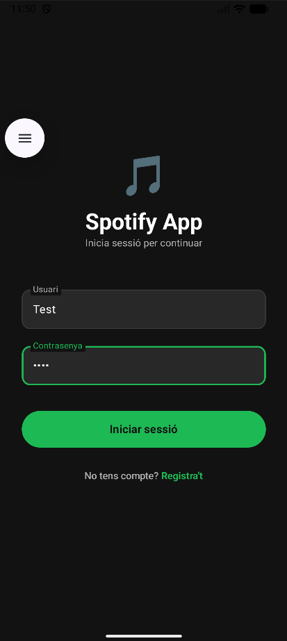
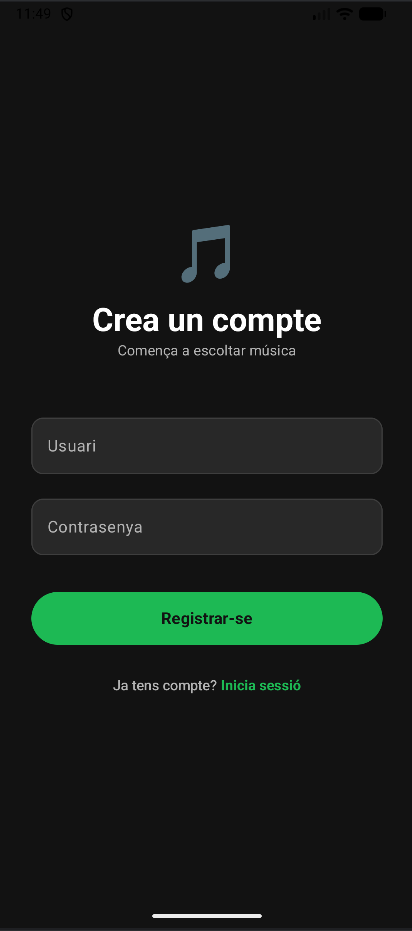
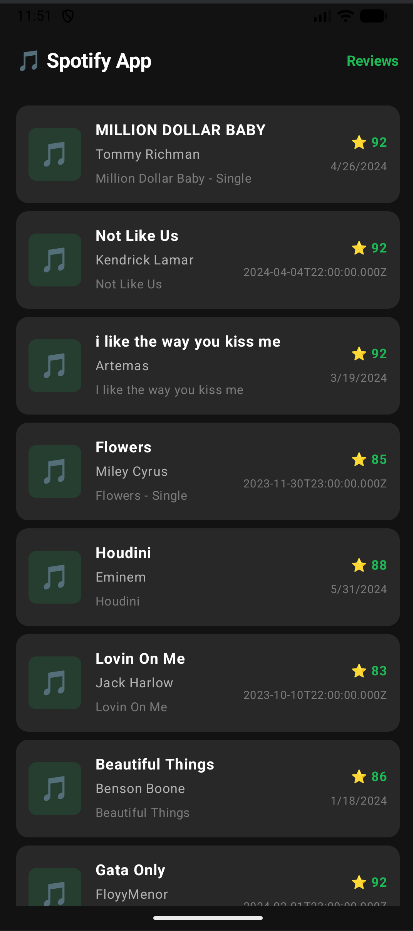
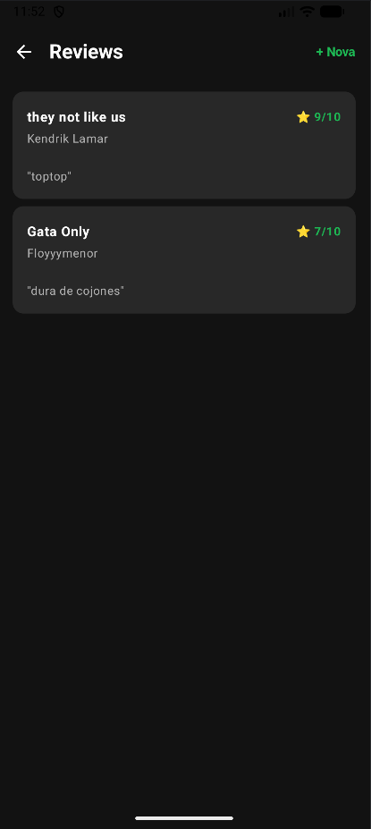
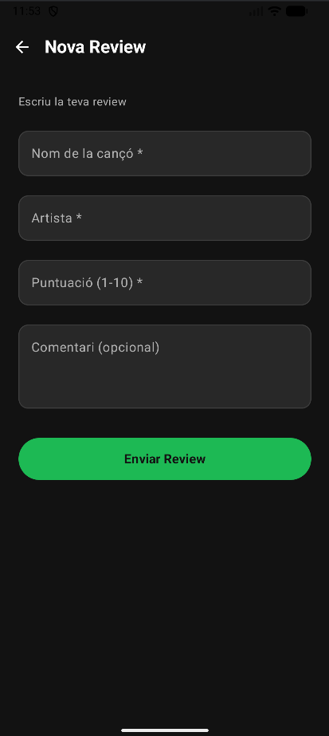

# 🎵 Spotify App — PR09 Apps Script API

Aplicació Android desenvolupada amb **Jetpack Compose** i arquitectura **MVVM** que consumeix una API REST creada amb **Google Apps Script** sobre un full de càlcul de Google Sheets.

---

## 📋 Índex

- [Descripció](#descripció)
- [Tecnologies](#tecnologies)
- [Arquitectura](#arquitectura)
- [API Apps Script](#api-apps-script)
- [Pantalles](#pantalles)
- [Demo](#demo)
- [Configuració](#configuració)

---

## Descripció

L'app permet als usuaris registrar-se i iniciar sessió, consultar un catàleg de cançons obtingut en temps real des de Google Sheets, i deixar reviews de les seves cançons favorites.

---

## Tecnologies

- **Android** — Jetpack Compose, Navigation, LiveData, ViewModel
- **Retrofit** — Peticions HTTP a la API
- **Shared Preferences** — Gestió de credencials d'usuari
- **Google Apps Script** — API REST amb `doGet` i `doPost`
- **Google Sheets** — Base de dades del dataset de Spotify

---

## Arquitectura

El projecte segueix l'arquitectura **MVVM** (Model-View-ViewModel):

```
app/
├── model/          # Data classes (Song, Review, ApiResponse)
├── network/        # Retrofit (ApiService, RetrofitInstance)
├── repository/     # SongsRepository, ReviewsRepository, SharedPrefsManager
├── viewmodel/      # AuthViewModel, SongsViewModel, ReviewsViewModel
└── view/           # Composables (LoginScreen, RegisterScreen, SongsScreen, ReviewsScreen, AddReviewScreen)
```

---

## API Apps Script

L'API està desplegada com a Web App de Google Apps Script sobre un Google Sheets amb dues pestanyes: `Songs` i `Reviews`.

### Endpoints GET

| Endpoint | Paràmetres | Descripció |
|----------|------------|------------|
| `songs` | `api_key` | Retorna les primeres 50 cançons |
| `reviews` | `api_key` | Retorna totes les reviews |

### Endpoints POST

| Endpoint | Camps requerits | Descripció |
|----------|-----------------|------------|
| `reviews` | `track_name`, `artist_name`, `rating` | Afegeix una nova review |


---

## Pantalles

### Login

> Pantalla d'inici de sessió amb validació de credencials guardades localment.



---

### Register

> Pantalla de registre. Les credencials es guarden a SharedPreferences en un fitxer XML al dispositiu.



---

### Llista de Cançons

> Pantalla principal. Carrega les cançons via GET a la API i les mostra en una `LazyColumn`.



---

### Llista de Reviews

> Pantalla de reviews. Carrega totes les reviews via GET i les mostra en una `LazyColumn`.



---

### Nova Review

> Formulari per afegir una nova review. Envia les dades via POST a la API i les insereix al Google Sheets en temps real.



---

## Demo

> Vídeo demostrant el flux complet de l'aplicació: login, visualització de cançons, creació d'una review i verificació en temps real al Google Sheets.


---

## Autor

Desenvolupat per **Gerard Fornés** — DAM2 0488 Desenvolupament d'interfícies